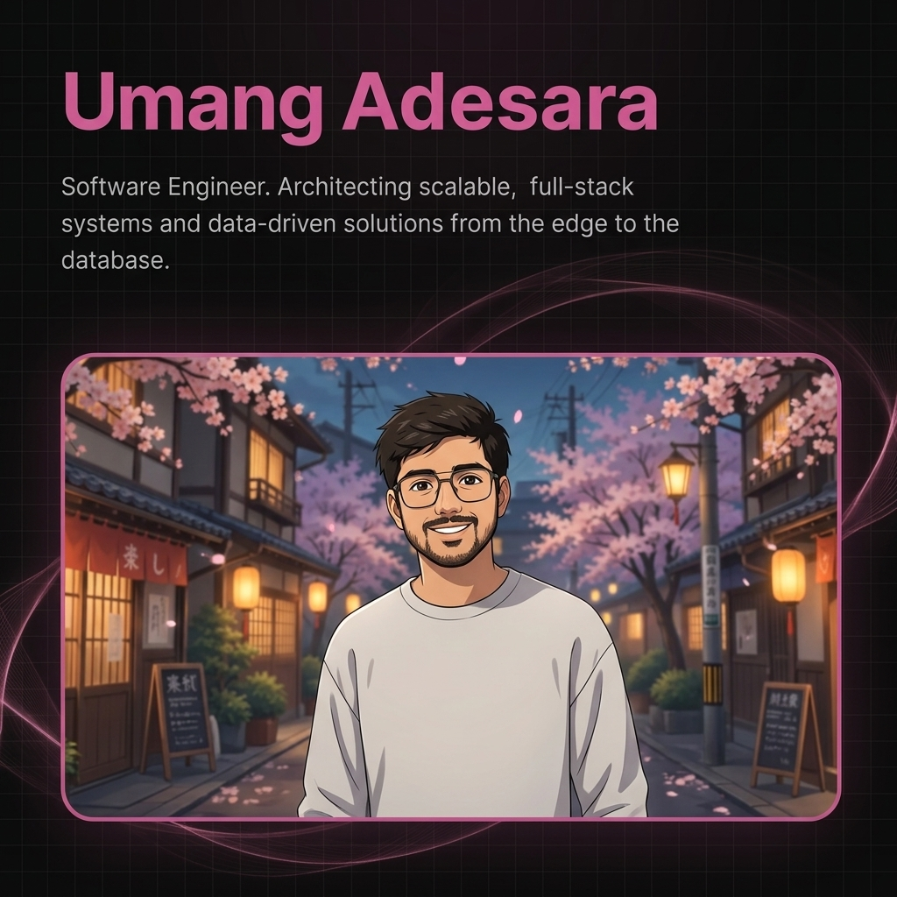

<div align="center">
  

  <br />
  <br />

  <h1>Umang Adesara | Full Stack & AI Engineer</h1>

  <p>
    <strong>A high-performance, edge-optimized developer portfolio built to showcase live system architectures, machine learning models, and full-stack deployments.</strong>
  </p>

  <p>
    <a href="https://umangadesara.com">View Live Portfolio</a>
    ·
    <a href="https://github.com/umang710/umangadesara-portfolio/issues">Report Bug</a>
    ·
    <a href="https://github.com/umang710/umangadesara-portfolio/issues">Request Feature</a>
  </p>

  <p>
    
    
    
    
    
  </p>
</div>

---

## 🧠 Core Philosophy

This portfolio ditches generic templates in favor of a strictly custom design system. It was built from the ground up prioritizing speed, aesthetic precision, and brutalist minimalism. From the dynamic dark/light mode toggle to the custom `brand-accent` glassmorphic hover effects, every pixel is engineered to feel premium and interactive.

## ✨ Key Features

### 1. The "System Fit Analyzer" (AI ATS Matcher)

Engineered a custom **Recruiting Match Engine** directly into the portfolio.

- Recruiters can paste a Job Description into a textarea.
- The system runs a semantic keyword analysis against my technical stack (including `Python`, `Groq LPU`, `RAG`, `LangChain`, `Next.js`, etc.).
- It outputs an instantaneous ATS Match Score, dynamically proving technical alignment.

### 2. Live Deployment Showcase

A dedicated `/projects` route highlighting real, production-grade applications with zero-latency preview cards:

- **Autonomous AI Control Plane:** Self-healing predictive microservice simulator.
- **Academic Intelligence Assistant:** RAG-powered chatbot running on Groq LPUs for instant inference.
- **SEO Content Quality Detector:** Scikit-Learn/NLP web app for semantic HTML auditing.

### 3. Edge-Optimized Performance

Statically generated using Next.js 15 App Router and deployed globally on Cloudflare's Edge Network, achieving sub-50ms load times worldwide.

## 🏗️ Technical Architecture

- **Frontend Framework:** Next.js 15 (React 19 RC)
- **Language:** TypeScript (Strict Mode)
- **Styling Engine:** Tailwind CSS v3
- **Animations:** Framer Motion (Spotlight cards, stagger effects, magnetic hovers)
- **Icons:** Lucide React & React Icons

## 🚀 Local Development

To run this portfolio locally and test the ATS Matcher or hover aesthetics:

1. **Clone the repository**

   ```bash
   git clone https://github.com/umang710/umangadesara-portfolio.git
   cd umangadesara-portfolio
   ```

2. **Install dependencies**

   ```bash
   npm install
   ```

3. **Run the development server**

   ```bash
   npm run dev
   ```

4. **View the application**
   Open [http://localhost:3000](http://localhost:3000) in your browser.

## 🎨 Design System (`tailwind.config.ts`)

The entire aesthetic is controlled via a centralized design system. To change the overall theme, simply modify the `brand` colors:

```typescript
colors: {
  brand: {
    accent: '#BB528A',       // The core pink aesthetic
    'accent-hover': '#a04575',
    light: '#F8F9FA',
    dark: '#121212',
  },
}
```

---

<div align="center">
  <i>Engineered with precision by Umang Adesara</i>
</div>
